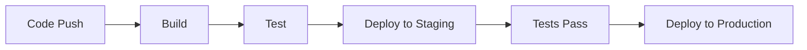

# CI/CD Setup Guide for VPN Dashboard

## CI/CD Pipeline Overview


## GitHub Actions Configuration
```yaml
name: VPN Dashboard CI/CD

on:
  push:
    branches: [ main, staging ]
  pull_request:
    branches: [ main, staging ]

jobs:
  test:
    runs-on: ubuntu-latest
    steps:
      - uses: actions/checkout@v2
      - name: Set up Python
        uses: actions/setup-python@v2
        with:
          python-version: '3.9'
      - name: Run Tests
        run: |
          pip install -r requirements.txt
          pytest tests/

  deploy:
    needs: test
    runs-on: ubuntu-latest
    steps:
      - name: Deploy
        run: |
          docker build -t vpn-dashboard .
          docker push your-registry/vpn-dashboard:latest
```

## Deployment Environments
- Development: Local environment
- Staging: Pre-production testing
- Production: Live environment

## Automated Testing
- Unit tests run on every push
- Integration tests run before deployment
- Performance tests run nightly

## Deployment Process
1. Code merge to main branch
2. Automated tests run
3. Docker image built
4. Deploy to staging
5. Run integration tests
6. Deploy to production

## Rollback Procedures
```bash
# Rollback to previous version
docker tag vpn-dashboard:previous vpn-dashboard:latest
docker push vpn-dashboard:latest

# Verify rollback
curl http://your-domain/health
```